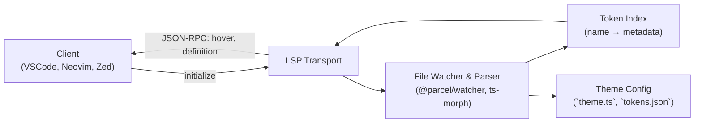

# Language Server Architecture Overview

This document outlines the high-level architecture and key responsibilities of
the Design Token Language Server.

## 1. Core Components

### 1.1 LSP Transport Layer

- **Connection**: Establishes an LSP connection over IPC, stdio, or socket.
- **Message Routing**: Dispatches incoming JSON-RPC requests (initialize, hover,
  definition, etc.) to handler modules.

### 1.2 Token Extraction & Indexing

- **File Scanner**: Globs theme files (`*.json`, `*.ts`) on startup and on
  change events.
- **Parsers**:
  - **JSON Parser**: Reads static JSON files and extracts key–value pairs.
  - **TypeScript Parser**: Uses ts-morph or the TypeScript compiler API to
    locate exported theme objects and identify `useToken()` patterns.
- **Index Store**: In-memory map from token name → { value, file URI, position }
  for fast lookups.

### 1.3 File Watcher

- **@parcel/watcher**: High-performance, native file watcher with cross-platform
  support.
- **Live Re-index**: Triggers incremental re-indexing on file add/change/unlink
  to keep the token store up to date.

### 1.4 LSP Feature Handlers

- **Hover Handler**: Given a position in a document, identifies
  `theme.getToken()` and returns the token’s value.
- **Completion Handler(no need for now)**: Suggests available token names with
  previews of their values.
- **Definition Handler**: Navigates from usage sites to the original declaration
  location of a token.
- **Rename Handler**: Updates all occurrences (declaration + usages) when a
  token is renamed (maybe typescript will handle this??).
- **(Optional) Diagnostics**: Warns about missing tokens or duplicates in the
  theme config.

## 2. Sequence of Operations

1. **Initialize**
   - Read `InitializeParams` (root URI, client capabilities).
   - Perform initial file scan and build token index.
   - Register file watchers.

2. **On File Events**
   - Re-parse changed files.
   - Update index store.
   - (Optional) Push diagnostics to clients.

3. **Handle LSP Requests**
   - Map JSON-RPC methods to feature handlers.
   - Use index store to serve hover, completion, go-to-definition, and rename
     edits.

4. **Shutdown**
   - Dispose watchers and close LSP connection gracefully.

## 3. Extensibility & Packaging

- **Core Package (`token-lsp`)**
  - Contains all parsing, indexing, and LSP logic.
  - Published as an npm module.

- **Editor Adapters**
  - **VSCode Extension**: Thin wrapper using `vscode-languageclient` to
    configure and launch the server.
  - **Neovim Plugin**: Configuration for `nvim-lspconfig` to point to the server
    binary.
  - **Zed Plugin**: Custom plugin that spawns the LSP server and wires features
    into Zed’s LSP client API.

## 4. Data Flow Diagram (Conceptual)

```text
+-------------+      initialize       +-------------+
|   Client    |--------------------->|    LSP      |
| (VSCode,    |<-- JSON-RPC hover ---|  Transport  |
|  Neovim,    |<-- definition edits -|             |
|   Zed)      |                      +------+------+
+-------------+                             |
                              +-------------v-------------+
                              |   File Watcher & Parser    |
                              | (@parcel/watcher, ts-morph)|
                              +-------------+-------------+
                                            |
                                   +--------v--------+
                                   |   Token Index    |
                                   | (name → metadata)|
                                   +--------+--------+
                                            |
                                   +--------v--------+
                                   | Theme Config     |
                                   |(`theme.ts`,      |
                                   | `tokens.json`)   |
                                   +-----------------+
```


